# AI Destekli Geliştirici Verimlilik Analizi

> Geliştirici performansı ve AI kullanımının yazılım geliştirme süreçlerine etkisini ölçümlemek için tasarlanmış kapsamlı bir analiz ve görselleştirme platformu.

**Son Güncelleme**: Kasım 2025

---

## 📋 Table of Contents

1. [📊 Genel Bakış](#genel-bakış)
   - [Veri Kaynakları](#veri-kaynakları)
   - [Önemli Not](#önemli-not)
   - [Amaç](#amaç)

2. [🏗️ Proje Yapısı ve Mimari](#proje-yapısı-ve-mimari)
   - [Mimari Diyagram](#mimari-diyagram)
   - [Klasör Yapısı](#klasör-yapısı)

3. [🚀 Hızlı Başlangıç ve Kurulum](#hızlı-başlangıç-ve-kurulum)
   - [Gereksinimler](#gereksinimler)
   - [Bağımlılıkları Yükleyin](#1-bağımlılıkları-yükleyin)
   - [Kullanıcı ve Takım Dosyalarını Yapılandırın](#2-kullanıcı-ve-takım-dosyalarını-yapılandırın)
   - [Git Metriklerini Toplayın](#3-git-metriklerini-toplayın)
   - [DORA Metriklerini Toplayın](#4-dora-metriklerini-toplayın-opsiyonel)
   - [Cursor Metriklerini Toplayın](#5-cursor-metriklerini-toplayın-opsiyonel)

4. [📦 Veri Yapıları ve Kategoriler](#veri-yapıları-ve-kategoriler)
   - [Git Commit Veri Yapısı](#git-commit-veri-yapısı)
   - [Alan Açıklamaları](#alan-açıklamaları)

5. [📂 Commit Kategorileri](#commit-kategorileri)
   - [🔨 Refactor (Yeniden Yapılandırma)](#1-🔨-refactor-yeniden-yapılandırma)
   - [✨ New Work (Yeni Çalışma)](#2-✨-new-work-yeni-çalışma)
   - [🤝 Help Others (Başkalarına Yardım)](#3-🤝-help-others-başkalarına-yardım)
   - [🔄 Churn/Rework (Sık Değişiklik)](#4-🔄-churnrework-sık-değişikyeniden-çalışma)
   - [Kategori Dağılımı İdeali](#kategori-dağılımı-i̇deali)
   - [Commit Kategori Belirleme](#commit-kategori-belirleme)

6. [🔬 Kategorizasyon Algoritmaları](#kategorizasyon-algoritmaları)
   - [6.1 Dosya Kategorizasyon Akışı](#61-dosya-kategorizasyon-akışı)
     - [Algoritma Mantığı](#algoritma-mantığı)
     - [Karar Ağacı](#karar-ağacı)
     - [Formül ve Hesaplamalar](#formül-ve-hesaplamalar)
     - [Örnekler](#örnekler)
   - [6.2 Commit Kategorizasyon Akışı](#62-commit-kategorizasyon-akışı)
     - [Ağırlıklı Skorlama Sistemi](#ağırlıklı-skorlama-sistemi)
     - [Algoritma](#algoritma)
     - [Formül](#formül)
     - [Örnek Hesaplamalar](#örnek-hesaplamalar)
     - [Ağırlık Sistemi Mantığı](#ağırlık-sistemi-mantığı)

7. [🎯 Metrikler Rehberi](#metrikler-rehberi)
   - [Git Commit Metrikleri](#git-commit-metrikleri)
     - [Commit Efficiency (cefficiency)](#1-commit-efficiency-cefficiency)
     - [Commit Impact](#2-commit-impact)
     - [Productive Score](#3-productive-score)
   - [DORA Metrikleri](#dora-metrikleri)
     - [Deployment Frequency](#1-deployment-frequency-dağıtım-sıklığı)
     - [Lead Time for Changes](#2-lead-time-for-changes-değişiklik-teslim-süresi)
     - [Change Failure Rate](#3-change-failure-rate-değişiklik-başarısızlık-oranı)
   - [Cursor AI Metrikleri](#cursor-ai-metrikleri)
     - [Acceptance Rate](#1-acceptance-rate-kabul-oranı)
     - [Cursor Score](#2-cursor-score-ai-kullanım-skoru)

8. [📊 Dashboard Görselleri](#dashboard-görselleri)
   - [Git Commit Görselleri](#git-commit-görselleri)
     - [1. Commit Statistics Details](#1-commit-statistics-details-data-table)
     - [2. Developer Score & AI Score](#2-developer-score--ai-score-line-chart)
     - [3-15. Diğer Commit Görselleri](#3-commit-count--ai-accepted-count-line-chart)
   - [Developer Performance Görselleri](#developer-performance-görselleri)
     - [16. Top Developers by AI Score](#16-top-developers-by-ai-score-donut-chart)
     - [17-24. Diğer Performance Görselleri](#17-top-developers-by-score-donut-chart)
   - [AI Metrikleri Görselleri](#ai-metrikleri-görselleri)
     - [25. AI Acceptance Rate](#25-ai-acceptance-rate-metric)
     - [26. File Types Comparison](#26-file-types-heavy-ai-users-vs-no-ai-users)
   - [DORA Metrikleri Görselleri](#dora-metrikleri-görselleri)
     - [27-34. DORA Görselleri](#27-dora-lead-time-average-by-team)
   - [İleri Analiz Görselleri](#i̇leri-analiz-görselleri)
     - [35. AI Impact on Deployment](#35-ai-impact-on-deployment-frequency)
     - [36. AI Usage vs Lead Time](#36-ai-usage-vs-lead-time-analysis)
   - [Dashboard Yerleştirme ve Layout](#dashboard-yerleştirme-ve-layout)
   - [Filtreleme ve Interactivity](#filtreleme-ve-interactivity)

9. [💼 Kullanım Örnekleri ve Senaryolar](#kullanım-örnekleri-ve-senaryolar)
   - [Senaryo 1: Yeni Ekip Üyesi Takibi](#senaryo-1-yeni-ekip-üyesinin-performans-takibi)
   - [Senaryo 2: Sprint Retrospective](#senaryo-2-sprint-retrospective-için-veri-analizi)
   - [Senaryo 3: AI Etkisi Analizi](#senaryo-3-ai-kullanımının-performansa-etkisi)
   - [Senaryo 4: Haftalık Takım Toplantısı](#senaryo-4-haftalık-takım-toplantısı)

10. [🔧 Script'ler ve Veri Toplama](#scriptler-ve-veri-toplama)
    - [Script Çalıştırma Sırası](#script-çalıştırma-sırası)
    - [Otomatik Çalıştırma](#otomatik-çalıştırma)
      - [Cron Job Örneği](#cron-job-örneği-linuxmacos)
      - [Task Scheduler (Windows)](#task-scheduler-windows)
    - [Performans İpuçları](#performans-i̇puçları)

11. [🔍 Sorun Giderme](#sorun-giderme)
    - [Elasticsearch Bağlantı Hatası](#elasticsearch-bağlantı-hatası)
    - [SQL Server Bağlantı Hatası](#sql-server-bağlantı-hatası)
    - [Cursor API Hatası](#cursor-api-hatası)
    - [Hata Ayıklama](#hata-ayıklama)

12. [🔒 Güvenlik ve En İyi Pratikler](#güvenlik-ve-en-i̇yi-pratikler)
    - [Güvenlik Notları](#güvenlik-notları)
    - [Dashboard Kullanma En İyi Pratikleri](#dashboard-kullanma-en-i̇yi-pratikleri)
      - [Günlük İnceleme](#günlük-i̇nceleme)
      - [Haftalık Review](#haftalık-review)
      - [Aylık Analiz](#aylık-analiz)
    - [Önemli Metrikler Hızlı Referans](#önemli-metrikler-hızlı-referans)

13. [🎓 Özet](#özet)

14. [📞 İletişim ve Destek](#i̇letişim-ve-destek)

---

## 📊 Genel Bakış

Bu proje, yazılım geliştirme ekiplerinin verimliliğini ve AI araçlarının (özellikle Cursor IDE) bu verimliliğe etkisini analiz etmek için üç temel veri kaynağını kullanmaktadır:

### Veri Kaynakları

- **Git Metrics**: Commit analizi, commit kategorileri, geliştirici verimliliği
- **DORA Metrics**: Deployment frequency, Lead Time, Change Failure Rate metrikleri
- **Cursor Metrics**: AI kullanım istatistikleri, kabul oranları, üretkenlik skorları

### ⚠️ Önemli Not

**Bu analiz ve dashboard, kişi değerlendirme amacı taşımaz; yalnızca proje ve geliştirme sürecindeki gelişim alanlarına dair genel bilgi sağlar.**

### 🎯 Amaç

- Geliştirici üretkenliğini objektif metriklerle ölçümlemek
- AI asistan araçlarının kod kalitesi ve hıza etkisini anlamak
- DORA metriklerini takip ederek sürekli iyileştirme alanlarını belirlemek
- Takım ve proje bazında karşılaştırmalı analizler yapmak

### Dashboard Görselleri

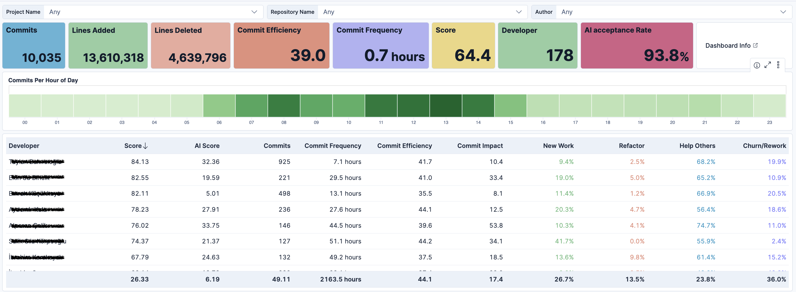

Geliştirici performans metrikleri: Geliştirici için commit, AI kullanım ve DORA verilerini içeren özet KPI kartları ve detaylı performans sıralaması tablosu.

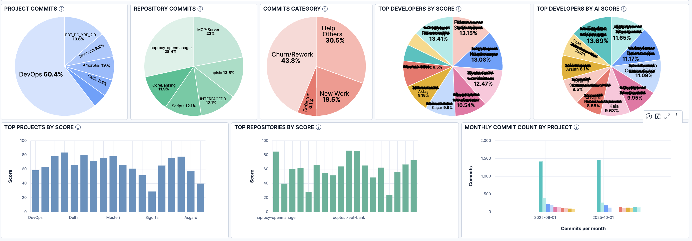

Proje ve repository analizi: Commit dağılımları, kategori oranları, geliştirici sıralamaları ve aylık aktivite trendlerini gösteren çok boyutlu görselleştirme paneli.

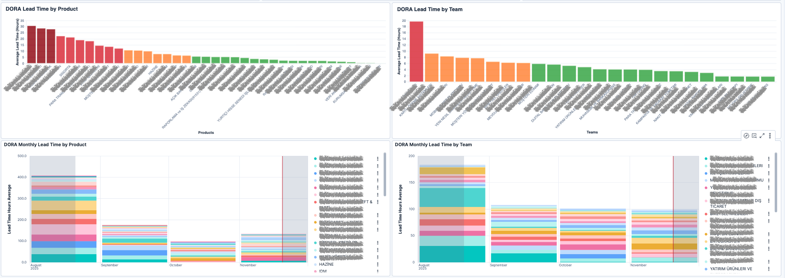

Dora metrikleri için ürün ve takım bazında ortalama teslim süreleri ile aylık trend değişimlerini renkli performans göstergeleriyle karşılaştırmalı görselleştirme.

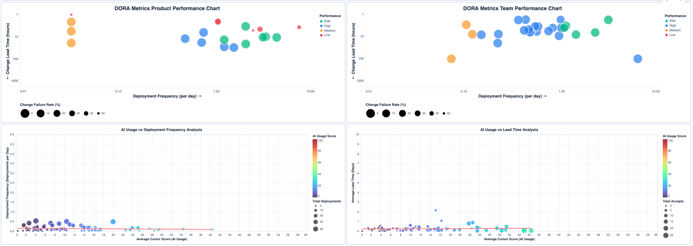

DORA ve AI korelasyon analizi: Ürün ve takım performans bubble chart'ları ile AI kullanımının deployment frekansı ve lead time üzerindeki etkisini gösteren scatter plot'lar.

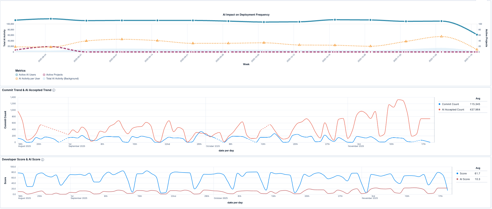

AI etki analizi: Haftalık AI kullanıcı sayısı ve deployment frekansı, günlük commit-AI kabul trendi, geliştirici ve AI performans skorlarının zaman serisi görselleştirmesi.

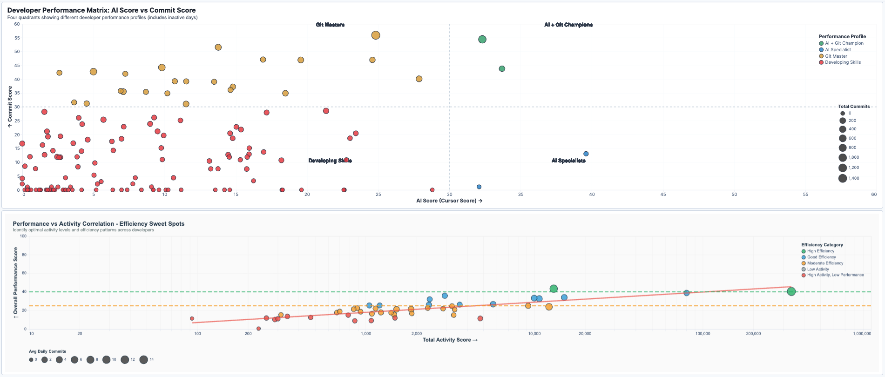

Geliştirici performans matrisi: AI ve commit skorlarına göre dört kadran sınıflandırması ile aktivite-verimlilik korelasyonunu gösteren efficiency sweet spots analizi.

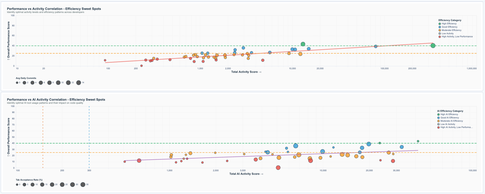

Verimlilik sweet spot analizi: Genel aktivite ve AI aktivitesinin performans skorlarıyla korelasyonu, optimal verimlilik bölgelerini gösteren çift scatter plot karşılaştırması.

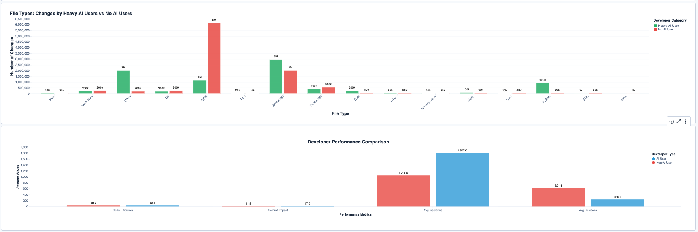

AI kullanım karşılaştırması: Yoğun AI kullanan ve kullanmayan geliştiricilerin dosya tipi değişiklikleri ile kod verimliliği, commit etkisi ve süre metriklerinin karşılaştırmalı analizi.

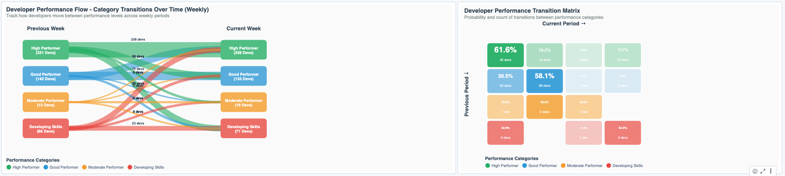

Geliştirici performans geçişleri: Haftalık performans kategorileri arası akış diyagramı ve geçiş olasılıklarını gösteren matris ile geliştiricilerin seviye değişimlerinin görselleştirilmesi.

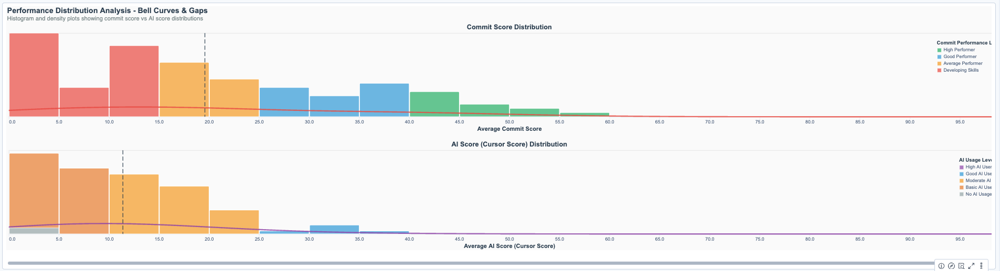

Performans dağılım analizi: Commit ve AI skorlarının histogram ve yoğunluk eğrileriyle kategorik dağılımı, ortalama değerler ve performans seviyelerinin bell curve görselleştirmesi.

---

## 🏗️ Proje Yapısı ve Mimari

### Mimari Diyagram

```
┌─────────────────┐
│   Git Repos     │──┐
└─────────────────┘  │
                     │    ┌──────────────┐
┌─────────────────┐  ├───▶│   Scripts    │──┐
│   SQL Server    │──┘    └──────────────┘  │
└─────────────────┘                         │    ┌────────────────┐
                                            ├───▶│ Elasticsearch  │
┌─────────────────┐       ┌──────────────┐ │    └────────────────┘
│  Cursor API     │──────▶│   Scripts    │─┘            │
└─────────────────┘       └──────────────┘              │
                                                         ▼
                                                ┌────────────────┐
                                                │     Kibana     │
                                                │   Dashboard    │
                                                └────────────────┘
```

### Klasör Yapısı

```
.
├── README.md                      # Genel bilgiler
├── DATA_STRUCTURE.md              # Veri yapıları ve kategoriler
├── METRICS_GUIDE.md               # Metriklerin detaylı açıklaması
├── WIDGETS_GUIDE.md               # Dashboard görsel ve açıklamaları
├── EXAMPLES.md                    # Kullanım örnekleri
├── scripts/                       # Veri işleme scriptleri
│   ├── gitstats.py               # Git commit analizi
│   ├── dora-metrics.py           # DORA metrikleri toplama
│   ├── cursor_metrics.py         # Cursor AI kullanım metrikleri
│   ├── requirements.txt          # Python bağımlılıkları
│   ├── users.txt.example         # Kullanıcı eşleştirmeleri örneği
│   ├── teams.txt.example         # Takım tanımlamaları örneği
│   └── README.md                 # Script'ler hakkında bilgi
└── images/                        # Dashboard görselleri
```

---

## 🚀 Hızlı Başlangıç ve Kurulum

### Gereksinimler

- Python 3.8+
- Elasticsearch 7.17.x
- Kibana 7.17.x
- Git repository erişimi
- (Opsiyonel) SQL Server - DORA metrikleri için
- (Opsiyonel) Cursor API erişimi

### 1. Bağımlılıkları Yükleyin

```bash
pip install -r scripts/requirements.txt
```

### 2. Kullanıcı ve Takım Dosyalarını Yapılandırın

**users.txt Formatı**: `UserAlias-CorporateName`
```bash
echo "U12345-John Doe" >> scripts/users.txt
echo "U67890-Jane Smith" >> scripts/users.txt
```

**teams.txt Formatı**: `DeveloperName=TeamName`
```bash
echo "John Doe=Backend Team" >> scripts/teams.txt
echo "Jane Smith=Frontend Team" >> scripts/teams.txt
```

### 3. Git Metriklerini Toplayın

```bash
python scripts/gitstats.py \
  --repo-path /path/to/repo \
  --elasticsearch-url http://localhost:9200 \
  --elasticsearch-user elastic \
  --elasticsearch-password your-password \
  --names-input-file scripts/users.txt
```

### 4. DORA Metriklerini Toplayın (Opsiyonel)

```bash
python scripts/dora-metrics.py \
  --elasticsearch-url http://localhost:9200 \
  --elasticsearch-user elastic \
  --elasticsearch-password your-password \
  --db-host your-sql-server \
  --db-name your-database \
  --db-username your-username \
  --db-password your-password \
  --teams-file scripts/teams.txt
```

### 5. Cursor Metriklerini Toplayın (Opsiyonel)

```bash
python scripts/cursor_metrics.py \
  --cursor-api-url https://api.cursor.com \
  --cursor-username your-username \
  --cursor-password your-password \
  --elasticsearch-url http://localhost:9200 \
  --elasticsearch-user elastic \
  --elasticsearch-password your-password \
  --users-file scripts/users.txt
```

---

## 📦 Veri Yapıları ve Kategoriler

### Git Commit Veri Yapısı

Her commit, aşağıdaki bilgileri içeren bir JSON dökümanı olarak Elasticsearch'e indexlenir:

```json
{
  "sha": "159792db9ef7661c4def3ebde8d26be96bcb2544",
  "author": "John Doe",
  "email": "jdoe@company.com",
  "commit_date": 1721116725,
  "date": "2024-07-16T07:58:45",
  "message": "Citizenship number updated to customerId",
  "project_name": "Neobank",
  "repository_name": "Neobank",
  "total_files_changed": 6,
  "insertions": 12,
  "deletions": 12,
  "category": "Churn/Rework",
  "cefficiency": 0.25,
  "commit_impact": 2.1,
  "files": [
    {
      "insertions": 3,
      "deletions": 3,
      "file": "api/AccountModule.cs",
      "category": "Churn/Rework"
    }
  ]
}
```

### Alan Açıklamaları

| Alan | Tip | Açıklama |
|------|-----|----------|
| `sha` | string | Commit'in benzersiz SHA hash değeri |
| `author` | string | Commit yapan geliştiricinin adı |
| `email` | string | Geliştiricinin e-posta adresi |
| `commit_date` | integer | Unix timestamp (saniye) |
| `date` | string | ISO 8601 format tarih-saat |
| `message` | string | Commit mesajı |
| `project_name` | string | Proje adı |
| `repository_name` | string | Repository adı |
| `total_files_changed` | integer | Değişen dosya sayısı |
| `insertions` | integer | Eklenen satır sayısı |
| `deletions` | integer | Silinen satır sayısı |
| `category` | string | Commit kategorisi (4 kategoriden biri) |
| `cefficiency` | float | Commit verimliliği (0-1 arası) |
| `commit_impact` | float | Commit etkisi skoru |
| `files` | array | Değişen dosyaların detayları |

---

## 📂 Commit Kategorileri

Her commit, yapılan değişikliklerin niteliğine göre 4 kategoriden birine atanır:

### 1. 🔨 Refactor (Yeniden Yapılandırma)

**Tanım**: Mevcut kodun iyileştirilmesi, optimize edilmesi veya temizlenmesi.

**Kriter**:
- Dosyanın son değiştirilme tarihi **3 haftadan eski** olmalı
- Toplam değişiklik (ekleme + silme) **10 satırdan fazla** olmalı

**Ağırlık**: 8 (En yüksek değer)

**Örnek**:
- Eski kod bloklarının temizlenmesi
- Performans optimizasyonları
- Kod standardizasyonu
- Mimari iyileştirmeler

### 2. ✨ New Work (Yeni Çalışma)

**Tanım**: Tamamen yeni özellik veya kod eklenmesi.

**Kriter**:
- Dosya ilk defa oluşturulmuş olmalı, VEYA
- Dosyada sadece ekleme yapılmış, silme olmamalı

**Ağırlık**: 6

**Örnek**:
- Yeni API endpoint'leri
- Yeni servisler veya modüller
- Yeni test dosyaları
- Yeni özellik geliştirmeleri

### 3. 🤝 Help Others (Başkalarına Yardım)

**Tanım**: Başka bir geliştiricinin yazdığı kodu düzeltme veya geliştirme.

**Kriter**:
- Dosyayı en son değiştiren kişi, mevcut commit'i yapandan **farklı** olmalı
- Son değişiklik **3 haftadan yeni** olmalı

**Ağırlık**: 5

**Örnek**:
- Takım arkadaşının kodundaki bug düzeltme
- Code review sonrası düzeltmeler
- Pair programming katkıları
- Acil hotfix'ler

### 4. 🔄 Churn/Rework (Sık Değişiklik/Yeniden Çalışma)

**Tanım**: Kısa süre önce değiştirilen kodun tekrar değiştirilmesi.

**Kriter**:
- Diğer 3 kategoriye girmeyen tüm değişiklikler

**Ağırlık**: 4 (En düşük değer)

**Örnek**:
- Hatalı implementasyon düzeltmeleri
- Gereksinim değişiklikleri
- Eksik kalan işlerin tamamlanması
- Sürekli değişen kodlar (code smell)

### Kategori Dağılımı İdeali

Sağlıklı bir geliştirme sürecinde beklenen kategori dağılımı:

| Kategori | İdeal Oran | Açıklama |
|----------|------------|----------|
| New Work | 40-50% | Ana odak yeni özellikler olmalı |
| Refactor | 20-30% | Düzenli kod iyileştirmeleri |
| Help Others | 10-20% | Takım iş birliği |
| Churn/Rework | <20% | Düşük olmalı (yüksek ise kod kalite problemi olabilir) |

### Commit Kategori Belirleme

Bir commit'in kategorisi, içindeki tüm dosya değişikliklerinin kategorilerine göre **ağırlıklı ortalama** ile belirlenir.

**Hesaplama Adımları**:

1. Her dosya için kategori belirlenir
2. Her kategorinin ağırlıklı puanı hesaplanır
3. En yüksek puana sahip kategori seçilir

**Örnek Hesaplama**:

Bir commit'te 5 dosya değişmiş olsun:

| Dosya | Kategori | Ağırlık |
|-------|----------|---------|
| File1.cs | New Work | 6 |
| File2.cs | New Work | 6 |
| File3.cs | Refactor | 8 |
| File4.cs | Churn/Rework | 4 |
| File5.cs | Churn/Rework | 4 |

**Toplam Skorlar**:
- New Work: 2 × 6 = 12
- Refactor: 1 × 8 = 8
- Churn/Rework: 2 × 4 = 8

**Sonuç**: Commit kategorisi = **New Work**

---

## 🔬 Kategorizasyon Algoritmaları

Bu bölüm, `gitstats.py` script'inde kullanılan kategorizasyon algoritmalarının detaylı açıklamasını içerir.

### 6.1 Dosya Kategorizasyon Akışı

Her dosya değişikliği, commit içinde bağımsız olarak kategorize edilir. `categorize_file()` fonksiyonu aşağıdaki mantıkla çalışır:

#### Algoritma Mantığı

```python
def categorize_file(file_stat, commit_author, commit_date, commit_hash, parent_hashes):
    """
    Bir dosya değişikliğini kategorize eder.
    
    Parametreler:
    - file_stat: Dosya istatistikleri (insertions, deletions, file path)
    - commit_author: Commit'i yapan kişi
    - commit_date: Commit tarihi (Unix timestamp)
    - commit_hash: Commit SHA
    - parent_hashes: Parent commit'lerin SHA'ları
    
    Kategoriler:
    - New Work: Yeni dosya veya sadece ekleme yapılan değişiklikler
    - Refactor: Eski kodun (>3 hafta) büyük ölçekli iyileştirilmesi
    - Help Others: Başka geliştiricinin yakın zamandaki koduna müdahale
    - Churn/Rework: Diğer durumlar (kendi yakın zamandaki kodunu değiştirme)
    """
```

#### Karar Ağacı

```
                    Dosya Değişikliği
                           |
                           v
                  ┌─────────────────┐
                  │ Dosya geçmişi   │
                  │ var mı?         │
                  └────────┬────────┘
                           |
            ┌──────────────┴──────────────┐
            |                             |
          HAYIR                         EVET
            |                             |
            v                             v
      ┌──────────┐              ┌─────────────────┐
      │ New Work │              │ Zaman farkı     │
      └──────────┘              │ hesapla         │
                                └────────┬────────┘
                                         |
                    ┌────────────────────┴────────────────────┐
                    |                                         |
              > 3 hafta                                  <= 3 hafta
                    |                                         |
                    v                                         v
        ┌───────────────────────┐              ┌─────────────────────┐
        │ Toplam değişiklik     │              │ Son author ==       │
        │ > 10 satır mı?        │              │ Mevcut author?      │
        └──────────┬────────────┘              └──────────┬──────────┘
                   |                                       |
         ┌─────────┴─────────┐                  ┌─────────┴─────────┐
         |                   |                  |                   |
       EVET                HAYIR              EVET                HAYIR
         |                   |                  |                   |
         v                   v                  v                   v
    ┌──────────┐    ┌──────────────┐    ┌─────────────┐    ┌──────────────┐
    │ Refactor │    │ Churn/Rework │    │ Sadece      │    │ Help Others  │
    └──────────┘    └──────────────┘    │ ekleme mi?  │    └──────────────┘
                                         └──────┬──────┘
                                                |
                                      ┌─────────┴─────────┐
                                      |                   |
                                    EVET                HAYIR
                                      |                   |
                                      v                   v
                                 ┌──────────┐    ┌──────────────┐
                                 │ New Work │    │ Churn/Rework │
                                 └──────────┘    └──────────────┘
```

#### Formül ve Hesaplamalar

**1. Zaman Farkı Hesaplaması**

```python
refactor_threshold = 3 * 7 * 24 * 60 * 60  # 3 hafta = 1,814,400 saniye

time_diff = commit_date - last_modification_date

# Eşik kontrolü
if time_diff > refactor_threshold:
    # 3 haftadan eski
else:
    # 3 hafta içinde
```

**2. Refactor Kriterleri**

```python
# Koşul 1: Zaman farkı > 3 hafta
time_diff > 1_814_400  # saniye

# Koşul 2: Toplam değişiklik > 10 satır
total_changes = insertions + deletions
total_changes > 10

# Sonuç:
if (time_diff > threshold) AND (total_changes > 10):
    category = 'Refactor'
```

**3. Help Others Kriterleri**

```python
# Koşul 1: Zaman farkı <= 3 hafta
time_diff <= 1_814_400

# Koşul 2: Farklı yazar
last_author != current_commit_author

# Sonuç:
if (time_diff <= threshold) AND (last_author != current_author):
    category = 'Help Others'
```

**4. New Work Kriterleri**

```python
# Durum 1: Dosya geçmişi yok (yeni dosya)
if not last_author or not last_date:
    category = 'New Work'

# Durum 2: Sadece ekleme yapılmış (silme yok)
if has_additions and not has_deletions:
    category = 'New Work'
```

#### Örnekler

**Örnek 1: Refactor**
```
Dosya: api/UserService.cs
Son değişiklik: 25 gün önce
Son yazar: John Doe
Mevcut yazar: John Doe
Değişiklik: +15 satır, -12 satır (toplam: 27 satır)

Mantık:
✓ Zaman farkı (25 gün) > 3 hafta (21 gün)
✓ Toplam değişiklik (27) > 10 satır
→ Kategori: Refactor
```

**Örnek 2: Help Others**
```
Dosya: components/Button.tsx
Son değişiklik: 2 gün önce
Son yazar: Jane Smith
Mevcut yazar: John Doe
Değişiklik: +5 satır, -3 satır

Mantık:
✓ Zaman farkı (2 gün) <= 3 hafta
✓ Farklı yazar (Jane → John)
→ Kategori: Help Others
```

**Örnek 3: New Work**
```
Dosya: utils/NewHelper.ts
Son değişiklik: -
Son yazar: -
Mevcut yazar: John Doe
Değişiklik: +50 satır, -0 satır

Mantık:
✓ Dosya geçmişi yok (yeni dosya)
→ Kategori: New Work
```

**Örnek 4: Churn/Rework**
```
Dosya: services/PaymentService.cs
Son değişiklik: 1 gün önce
Son yazar: John Doe
Mevcut yazar: John Doe
Değişiklik: +8 satır, -6 satır

Mantık:
✓ Zaman farkı (1 gün) <= 3 hafta
✓ Aynı yazar
✗ Sadece ekleme değil (silme de var)
→ Kategori: Churn/Rework
```

---

### 6.2 Commit Kategorizasyon Akışı

Bir commit'in genel kategorisi, içindeki **tüm dosya kategorilerinin ağırlıklı skorlaması** ile belirlenir.

#### Ağırlıklı Skorlama Sistemi

Her kategori için önceden tanımlanmış ağırlık değerleri vardır:

```python
category_weights = {
    'Refactor': 8,        # En yüksek değer
    'New Work': 6,
    'Help Others': 5,
    'Churn/Rework': 4     # En düşük değer
}
```

#### Algoritma

```python
def determine_commit_category(category_counts):
    """
    Commit kategorisini ağırlıklı skorlama ile belirler.
    
    Parametreler:
    - category_counts: Her kategoriden kaç dosya olduğunu içeren dictionary
      Örnek: {'New Work': 3, 'Refactor': 1, 'Churn/Rework': 2}
    
    Returns:
    - En yüksek ağırlıklı skora sahip kategori
    """
    weighted_scores = {}
    
    for category, weight in category_weights.items():
        file_count = category_counts.get(category, 0)
        weighted_scores[category] = file_count * weight
    
    # En yüksek skora sahip kategoriyi seç
    commit_category = max(weighted_scores, key=weighted_scores.get)
    
    return commit_category
```

#### Formül

```
Kategori Skoru = Dosya Sayısı × Kategori Ağırlığı

Commit Kategorisi = max(Kategori Skorları)
```

Matematiksel gösterim:

```
S(Refactor) = n_refactor × 8
S(New Work) = n_newwork × 6
S(Help Others) = n_helpothers × 5
S(Churn/Rework) = n_churn × 4

Commit_Category = argmax(S(Refactor), S(New Work), S(Help Others), S(Churn/Rework))
```

#### Örnek Hesaplamalar

**Örnek 1: Basit Durum**

```
Commit: abc123
Dosya değişiklikleri:
- File1.cs → New Work
- File2.cs → New Work
- File3.cs → New Work

Hesaplama:
S(New Work) = 3 × 6 = 18
S(Refactor) = 0 × 8 = 0
S(Help Others) = 0 × 5 = 0
S(Churn/Rework) = 0 × 4 = 0

Sonuç: Commit kategorisi = New Work (skor: 18)
```

**Örnek 2: Karışık Durum**

```
Commit: def456
Dosya değişiklikleri:
- File1.cs → New Work
- File2.cs → New Work
- File3.cs → Refactor
- File4.cs → Churn/Rework
- File5.cs → Churn/Rework

Hesaplama:
S(New Work) = 2 × 6 = 12
S(Refactor) = 1 × 8 = 8
S(Help Others) = 0 × 5 = 0
S(Churn/Rework) = 2 × 4 = 8

Sonuç: Commit kategorisi = New Work (skor: 12)
```

**Örnek 3: Refactor Dominant**

```
Commit: ghi789
Dosya değişiklikleri:
- File1.cs → Refactor
- File2.cs → Refactor
- File3.cs → New Work
- File4.cs → Churn/Rework

Hesaplama:
S(Refactor) = 2 × 8 = 16
S(New Work) = 1 × 6 = 6
S(Help Others) = 0 × 5 = 0
S(Churn/Rework) = 1 × 4 = 4

Sonuç: Commit kategorisi = Refactor (skor: 16)
```

**Örnek 4: Eşitlik Durumu**

```
Commit: jkl012
Dosya değişiklikleri:
- File1.cs → Refactor
- File2.cs → New Work
- File3.cs → New Work

Hesaplama:
S(Refactor) = 1 × 8 = 8
S(New Work) = 2 × 6 = 12
S(Help Others) = 0 × 5 = 0
S(Churn/Rework) = 0 × 4 = 0

Sonuç: Commit kategorisi = New Work (skor: 12)
```

**Örnek 5: Çok Dosyalı Commit**

```
Commit: mno345
Dosya değişiklikleri:
- File1.cs → New Work
- File2.cs → New Work
- File3.cs → New Work
- File4.cs → Refactor
- File5.cs → Help Others
- File6.cs → Churn/Rework
- File7.cs → Churn/Rework
- File8.cs → Churn/Rework

Hesaplama:
S(New Work) = 3 × 6 = 18
S(Refactor) = 1 × 8 = 8
S(Help Others) = 1 × 5 = 5
S(Churn/Rework) = 3 × 4 = 12

Sonuç: Commit kategorisi = New Work (skor: 18)
```

#### Ağırlık Sistemi Mantığı

Ağırlık değerleri, kategorilerin **iş değerini** ve **kod kalitesine katkısını** yansıtır:

| Kategori | Ağırlık | Mantık |
|----------|---------|--------|
| **Refactor** | 8 | En yüksek değer - Kod kalitesini artırır, teknik borcu azaltır |
| **New Work** | 6 | Yüksek değer - Yeni özellikler ve değer üretir |
| **Help Others** | 5 | Orta değer - Takım işbirliği ve bilgi paylaşımı |
| **Churn/Rework** | 4 | En düşük değer - Potansiyel kalite problemi göstergesi |

Bu ağırlıklandırma sayesinde:
- ✅ Az sayıda **Refactor** bile commit kategorisini etkileyebilir
- ✅ Çok sayıda **Churn/Rework** olsa bile, birkaç **New Work** dosyası kategoriyi değiştirebilir
- ✅ **Kalite odaklı** değişikliklere öncelik verilir

---

## 🎯 Metrikler Rehberi

### Git Commit Metrikleri

#### 1. Commit Efficiency (cefficiency)

Commit verimliliği, yeni yazılmış kod satırlarının, yeniden yazılan kod satırlarına oranını ölçer.

**Formül**:
```python
if insertions > 0:
    cefficiency = insertions / (insertions + deletions)
else:
    cefficiency = 0
```

**Yorumlama**:
- `1.0`: Sadece yeni kod eklendi (ideal)
- `0.5`: Eşit miktarda ekleme ve silme
- `0.0`: Sadece kod silindi

**İdeal Değer**: > 0.7

#### 2. Commit Impact

Commit'in kod tabanına etkisini ölçer. Logaritmik ölçek kullanır.

**Formül**:
```python
if total_changes > 1:
    commit_impact = log10(total_changes)
else:
    commit_impact = 0
```

**Yorumlama**:
- `< 1`: Küçük değişiklik (< 10 satır)
- `1-2`: Orta seviye değişiklik (10-100 satır)
- `2-3`: Büyük değişiklik (100-1000 satır)
- `> 3`: Çok büyük değişiklik (> 1000 satır)

#### 3. Productive Score

Geliştiricinin genel üretkenlik skoru.

**Formül**:
```python
productive_score = (
    (new_work_percentage * 0.4) +
    (refactor_percentage * 0.3) +
    (help_others_percentage * 0.2) +
    ((1 - churn_percentage) * 0.1)
) * 100
```

---

### DORA Metrikleri

#### 1. Deployment Frequency (Dağıtım Sıklığı)

**Tanım**: Belirli bir zaman diliminde production'a yapılan dağıtım sayısı.

**DORA Seviyeleri**:

| Seviye | Frekans | Durum |
|--------|---------|-------|
| Elite | Günde birden fazla | ⭐⭐⭐⭐ |
| High | Haftada bir - Günde bir | ⭐⭐⭐ |
| Medium | Ayda bir - Haftada bir | ⭐⭐ |
| Low | Ayda birden az | ⭐ |

**İyileştirme Önerileri**:
- ✅ CI/CD pipeline'larını otomatikleştirin
- ✅ Feature flag'leri kullanın
- ✅ Küçük, sık release'ler yapın
- ✅ Deployment risklerini azaltın

#### 2. Lead Time for Changes (Değişiklik Teslim Süresi)

**Tanım**: Kod commit'inden production'a kadar geçen süre.

**Formül**:
```
lead_time = deployment_time - first_commit_time
```

**DORA Seviyeleri**:

| Seviye | Süre | Durum |
|--------|------|-------|
| Elite | < 1 gün | ⭐⭐⭐⭐ |
| High | 1 gün - 1 hafta | ⭐⭐⭐ |
| Medium | 1 hafta - 1 ay | ⭐⭐ |
| Low | 1 ay - 6 ay | ⭐ |

**İyileştirme Önerileri**:
- ✅ Code review süresini kısaltın
- ✅ Test otomasyonunu artırın
- ✅ Deployment sürecini basitleştirin
- ✅ Batch size'ı küçültün

#### 3. Change Failure Rate (Değişiklik Başarısızlık Oranı)

**Tanım**: Production'a yapılan değişikliklerin başarısız olma yüzdesi.

**Formül**:
```
change_failure_rate = (failed_deployments / total_deployments) * 100
```

**DORA Seviyeleri**:

| Seviye | Oran | Durum |
|--------|------|-------|
| Elite | 0% - 15% | ⭐⭐⭐⭐ |
| High | 16% - 30% | ⭐⭐⭐ |
| Medium | 31% - 45% | ⭐⭐ |
| Low | > 45% | ⭐ |

---

### Cursor AI Metrikleri

#### 1. Acceptance Rate (Kabul Oranı)

**Tanım**: AI tarafından önerilen kod parçalarının geliştiriciler tarafından kabul edilme yüzdesi.

**Formül**:
```
acceptance_rate = (acceptances / (acceptances + rejections)) * 100
```

**Yorumlama**:

| Oran | Anlamı | Durum |
|------|--------|-------|
| 80% - 100% | AI önerileri çok değerli | ⭐⭐⭐⭐ |
| 60% - 80% | İyi AI kullanımı | ⭐⭐⭐ |
| 40% - 60% | Orta seviye | ⭐⭐ |
| < 40% | Düşük kalite öneriler | ⭐ |

#### 2. Cursor Score (AI Kullanım Skoru)

**Tanım**: Geliştiricinin AI asistanı ne kadar etkin kullandığını gösteren 0-100 arası kompozit skor.

**Formül**:
```python
cursor_score = (
    acceptance_rate * 0.40 +      # Kabul oranı ağırlığı
    usage_frequency * 0.30 +       # Kullanım sıklığı ağırlığı
    consistency * 0.20 +           # Tutarlılık ağırlığı
    efficiency * 0.10              # Verimlilik ağırlığı
)
```

**Yorumlama**:

| Skor | Seviye | Açıklama |
|------|--------|----------|
| 85 - 100 | 🏆 Master | AI'yı maksimum verimlilikle kullanıyor |
| 70 - 85 | ⭐ Expert | Çok iyi AI kullanımı |
| 55 - 70 | ✅ Good | Standart üstü kullanım |
| 40 - 55 | ⚠️ Average | Gelişme alanı var |
| < 40 | ❌ Poor | AI potansiyeli kullanılmıyor |

---

## 📊 Dashboard Görselleri

Dashboard, 35+ görselleştirme içerir. Her görsel için detaylı açıklamalar aşağıda sunulmuştur.

---

### Git Commit Görselleri

#### 1. Commit Statistics Details (Data Table)

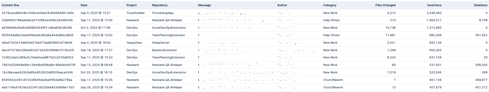

**Tür:** Veri Tablosu  
**Veri Kaynağı:** `git-stats` index

**Açıklama:** Tüm commit'lerin detaylı bilgilerini tablo formatında gösterir.

**Sütunlar:**
- **Commit SHA:** Commit'in benzersiz kimliği
- **Date:** Commit tarihi
- **Project:** Projenin adı
- **Repository:** Repository adı
- **Message:** Commit mesajı
- **Author:** Commit'i yapan geliştirici
- **Category:** Commit kategorisi (New Work, Refactor, Churn/Rework, Help Others)
- **Files Changed:** Değiştirilen dosya sayısı
- **Insertions:** Eklenen satır sayısı
- **Deletions:** Silinen satır sayısı

**Kullanım Amacı:**
- Commit'lerin detaylı incelenmesi
- Belirli commit'leri filtreleme ve arama
- Raw data analizi

---

#### 2. Developer Score & AI Score (Line Chart)

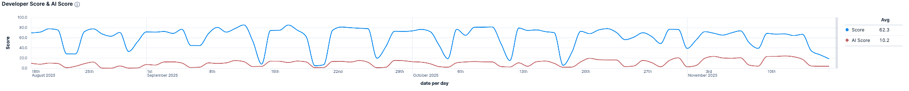

**Tür:** Çizgi Grafik  
**Veri Kaynağı:** `git-stats` ve `cursor-metrics` index

**Açıklama:** Geliştiricilerin hesaplanan performans skoru ile AI kullanım skorlarının zaman içindeki değişimini gösterir.

**Metrikler:**
- **Developer Score (Mavi Çizgi):** Karmaşık formülle hesaplanan geliştirici performans skoru
- **AI Score (Kırmızı Çizgi):** Cursor AI kullanım effectiveness skoru

**Kullanım Amacı:**
- Performans trendlerini takip etmek
- AI kullanımının performansa etkisini görmek
- Zaman içindeki gelişimi analiz etmek

---

#### 3. Commit Count & AI Accepted Count (Line Chart)

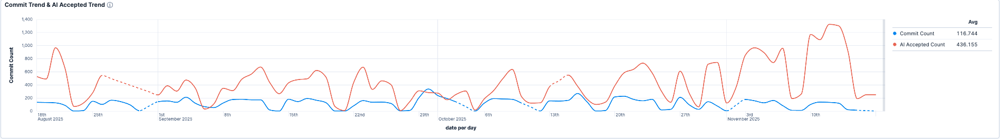

**Tür:** Çizgi Grafik  
**Veri Kaynağı:** `git-stats` ve `cursor-metrics` index

**Açıklama:** Günlük commit sayısı ile kabul edilen AI önerilerinin karşılaştırılması.

**Metrikler:**
- **Commit Count (Mavi Çizgi):** Günlük commit sayısı
- **AI Accepted Count (Turuncu Çizgi):** Kabul edilen AI önerilerinin sayısı

**Kullanım Amacı:**
- Aktivite seviyelerini izlemek
- AI kullanımı ile commit aktivitesi arasındaki ilişkiyi görmek
- Günlük produktivite pattern'lerini analiz etmek

---

#### 4. Monthly Commit Count by Project (Stacked Bar Chart)

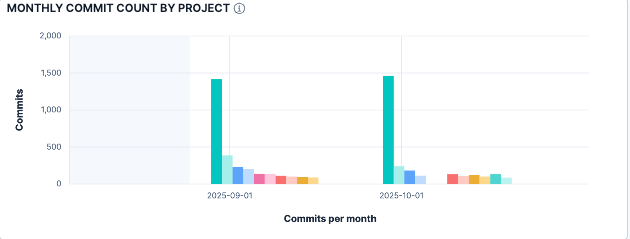

**Tür:** Yığın Bar Grafik  
**Veri Kaynağı:** `git-stats` index

**Açıklama:** Aylık bazda projelerin commit sayılarını yığın halinde gösterir.

**Metrikler:**
- **X Ekseni:** Aylar
- **Y Ekseni:** Commit sayısı
- **Renk Kodları:** Her proje için farklı renk

**Kullanım Amacı:**
- Proje aktivitelerini aylık takip etmek
- Proje bazlı kaynak dağılımını görmek
- Zaman içinde proje yoğunluklarını karşılaştırmak

---

#### 5. Top Repositories by Score (Horizontal Bar Chart)

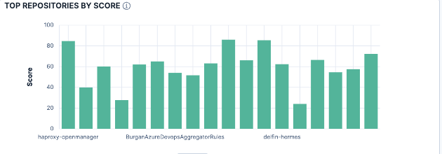

**Tür:** Yatay Bar Grafik  
**Veri Kaynağı:** `git-stats` index

**Açıklama:** Repository'leri hesaplanan performans skoruna göre sıralar.

**Metrikler:**
- **Y Ekseni:** Repository adları
- **X Ekseni:** Hesaplanan performans skoru
- **Sıralama:** Skoruna göre azalan sırada

**Kullanım Amacı:**
- En başarılı repository'leri belirlemek
- Repository bazlı performans karşılaştırması
- Best practice'leri paylaşmak için hedef repository'leri seçmek

---

#### 6. Top Projects by Score (Horizontal Bar Chart)

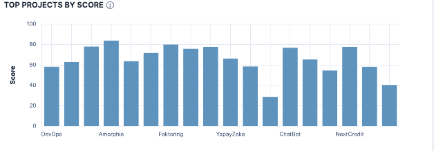

**Tür:** Yatay Bar Grafik  
**Veri Kaynağı:** `git-stats` index

**Açıklama:** Projeleri hesaplanan performans skoruna göre sıralar.

**Metrikler:**
- **Y Ekseni:** Proje adları
- **X Ekseni:** Hesaplanan performans skoru
- **Sıralama:** Skora göre azalan sırada

**Kullanım Amacı:**
- En yüksek kaliteli projeleri belirlemek
- Proje bazlı karşılaştırma yapmak
- Kaynak tahsisi için veri sağlamak

---

#### 7. Commits Category (Donut Chart)

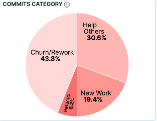

**Tür:** Halka Grafik  
**Veri Kaynağı:** `git-stats` index

**Açıklama:** Commit'lerin kategori bazında dağılımını gösterir.

**Kategoriler:**
- **New Work:** Yeni özellik geliştirme
- **Refactor:** Kod iyileştirme ve yeniden yapılandırma
- **Churn/Rework:** Hatalı kod düzeltmeleri ve tekrar çalışma
- **Help Others:** Diğer geliştiricilere yardım

**Kullanım Amacı:**
- Geliştirme aktivitelerinin dağılımını anlamak
- Sağlıklı bir kategori dengesi olup olmadığını kontrol etmek
- Yüksek churn oranlarını tespit etmek

---

#### 8. Repository Commits (Donut Chart)

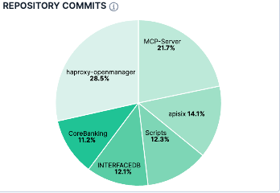

**Tür:** Halka Grafik  
**Veri Kaynağı:** `git-stats` index

**Açıklama:** Commit'lerin repository bazında dağılımını gösterir.

**Metrikler:**
- **Değer:** Repository başına commit sayısı
- **Kategoriler:** Repository adları
- **Görünüm:** Yüzdelik dilimler

**Kullanım Amacı:**
- Hangi repository'lerin daha aktif olduğunu görmek
- Repository bazlı workload dağılımını analiz etmek

---

#### 9. Project Commits (Donut Chart)

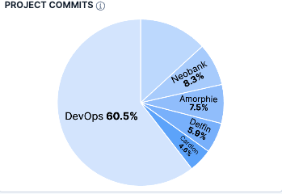

**Tür:** Halka Grafik  
**Veri Kaynağı:** `git-stats` index

**Açıklama:** Commit'lerin proje bazında dağılımını gösterir.

**Metrikler:**
- **Değer:** Proje başına commit sayısı
- **Kategoriler:** Proje adları
- **Görünüm:** Yüzdelik dilimler

**Kullanım Amacı:**
- Proje bazlı aktivite seviyelerini karşılaştırmak
- Kaynak dağılımını görselleştirmek

---

#### 10. Lines Deleted (Metric)

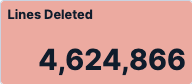

**Tür:** Metrik (Tek Sayı)  
**Veri Kaynağı:** `git-stats` index

**Açıklama:** Toplam silinen kod satırı sayısını gösterir.

**Metrikler:**
- **Değer:** Tüm commit'lerdeki toplam silinen satır sayısı (deletions)
- **Renk:** Turuncu tonunda (#e48f7d)

**Kullanım Amacı:**
- Kod temizleme aktivitelerini takip etmek
- Refactoring yoğunluğunu ölçmek

---

#### 11. Lines Added (Metric)

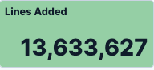

**Tür:** Metrik (Tek Sayı)  
**Veri Kaynağı:** `git-stats` index

**Açıklama:** Toplam eklenen kod satırı sayısını gösterir.

**Metrikler:**
- **Değer:** Tüm commit'lerdeki toplam eklenen satır sayısı (insertions)
- **Renk:** Yeşil tonunda

**Kullanım Amacı:**
- Yeni kod yazma miktarını takip etmek
- Productivity indicator olarak kullanmak

---

#### 12. Developer Count (Metric)


**Tür:** Metrik (Tek Sayı)  
**Veri Kaynağı:** `git-stats` index

**Açıklama:** Aktif geliştirici sayısının toplam benzersiz sayısını gösterir.

**Metrikler:**
- **Değer:** Unique developer count (author.keyword field'ından)
- **Renk:** Yeşil tonunda (#71be83)

**Kullanım Amacı:**
- Ekip büyüklüğünü izlemek
- Aktif contributor sayısını takip etmek

---

#### 13. Commits Per Hour of Day (Heat Map)

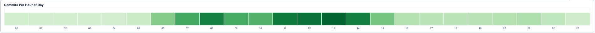

**Tür:** Isı Haritası  
**Veri Kaynağı:** `git-stats` index

**Açıklama:** Günün saatlerine göre commit yoğunluğunu renk derecelendirmesi ile gösterir.

**Metrikler:**
- **X Ekseni:** Saat aralıkları (00-23 formatında)
- **Renk Yoğunluğu:** Commit sayısına göre yeşil tonlaması
- **Değer:** Her saat dilimindeki toplam commit sayısı

**Görsel Özellikler:**
- 24 saat dilimi için dikdörtgen bloklar
- Yeşil renk skalası (açık yeşilden koyu yeşile)
- Interactive tooltip ile saat ve commit sayısı
- Minimal tasarım ile net görsellik

**Kullanım Amacı:**
- En yoğun çalışma saatlerini belirlemek
- Ekip çalışma pattern'lerini anlamak
- Deployment timing stratejileri için insight

---

#### 14. Commit Frequency (Metric)


**Tür:** Metrik (Duration)  
**Veri Kaynağı:** `git-stats` index

**Açıklama:** Ortalama commit sıklığını saat bazında hesaplayarak gösterir.

**Hesaplama Formülü:**
```
Commit Frequency = (time_range / 1000) / (commit_count + 1) / 1200
```

**Metrikler:**
- **Değer:** Saat cinsinden ortalama commit aralığı
- **Format:** Duration formatında gösterim (örn: 2.5 saat)
- **Renk:** Mor tonunda (#b0b2f4)

**Kullanım Amacı:**
- Commit yapma sıklığını izlemek
- Çok seyrek veya çok sık commit pattern'lerini tespit etmek

---

#### 15. Commit Efficiency (Metric)

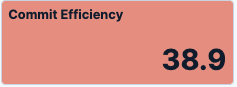

**Tür:** Metrik (Decimal Number)  
**Veri Kaynağı:** `git-stats` index

**Açıklama:** Ortalama commit verimliliği skorunu gösterir.

**Metrikler:**
- **Değer:** Ortalama efficiency skoru (cefficiency field'ından)
- **Format:** Ondalık sayı formatında (1 digit precision)
- **Renk:** Turuncu tonunda (#E48F7D)

**Efficiency Skoru Nedir:**
- Commit'in kod değişiklik kalitesini ölçen metrik
- Insertion/deletion oranı, dosya sayısı ve impact faktörlerine dayalı
- Yüksek değer = daha verimli kod değişiklikleri

**Kullanım Amacı:**
- Kod kalitesini takip etmek
- Verimlilik trendlerini izlemek

---

### Developer Performance Görselleri

#### 16. Top Developers by AI Score (Donut Chart)

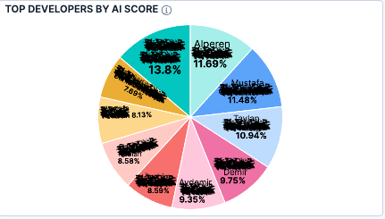

**Tür:** Halka Grafik  
**Veri Kaynağı:** `cursor-metrics` index

**Açıklama:** Geliştiricileri AI kullanım skorlarına göre gösterir.

**Metrikler:**
- **Değer:** Ortalama AI skoru
- **Kategoriler:** Geliştirici adları
- **Görünüm:** Yüzdelik dilimlerde

**Kullanım Amacı:**
- AI toollarını en etkin kullanan geliştiricileri belirlemek
- Geliştirici AI adoption seviyelerini karşılaştırmak
- AI eğitimi ve coaching ihtiyaçlarını tespit etmek

---

#### 17. Top Developers by Score (Donut Chart)


**Tür:** Halka Grafik  
**Veri Kaynağı:** `git-stats` index

**Açıklama:** Geliştiricileri hesaplanan genel performans skorlarına göre gösterir.

**Metrikler:**
- **Değer:** Hesaplanan geliştirici performans skoru
- **Kategoriler:** Geliştirici adları
- **Görünüm:** Yüzdelik dilimlerde

**Kullanım Amacı:**
- Top performer'ları belirlemek
- Performans dağılımını görmek
- Recognition ve best practice sharing için

---

#### 18. Developer Performance Table

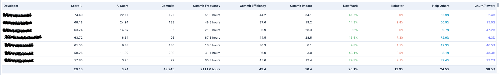

**Tür:** Veri Tablosu  
**Veri Kaynağı:** `git-stats` ve `cursor-metrics` index

**Açıklama:** Geliştiricilerin kapsamlı performans metriklerini tablo halinde gösterir.

**Sütunlar:**
- **Developer:** Geliştirici adı
- **Score:** Hesaplanan genel performans skoru
- **AI Score:** Cursor AI kullanım etkinlik skoru
- **Commits:** Toplam commit sayısı
- **Commit Impact:** Ortalama commit impact değeri
- **Commit Efficiency:** Ortalama commit efficiency değeri
- **Commit Frequency:** Commit sıklık oranı (saat cinsinden)
- **New Work:** Yeni iş kategorisindeki commit yüzdesi
- **Refactor:** Refactor kategorisindeki commit yüzdesi
- **Help Others:** Yardım kategorisindeki commit yüzdesi
- **Churn/Rework:** Churn/Rework kategorisindeki commit yüzdesi

**Kullanım Amacı:**
- Detaylı developer performance analizi
- Kıyaslama ve benchmarking
- Performance review için veri sağlamak

---

#### 19. Performance Distribution Analysis (Histogram)

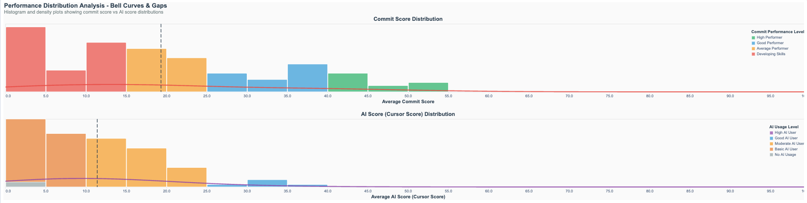

**Tür:** Histogram (Dual Panel)  
**Veri Kaynağı:** `git-stats` ve `cursor-metrics` index

**Açıklama:** Geliştirici performans skorlarının istatistiksel dağılımını histogram ile gösterir.

**Özellikler:**
- **Çift Panel Layout:** Commit Score ve AI Score ayrı ayrı analiz
- **Histogram Bars:** Her performans aralığındaki geliştirici sayısı
- **Team Average Lines:** Ortalama performans çizgileri
- **Kategorik Renklendirme:**
  - High Performer (Yeşil)
  - Good Performer (Mavi)
  - Average Performer (Turuncu)
  - Developing Skills (Kırmızı)

**Kullanım Amacı:**
- Performans dağılımının normal olup olmadığını görmek
- Outlier'ları tespit etmek
- Ekip average'ını görmek

---

#### 20. Developer Performance Transition Matrix

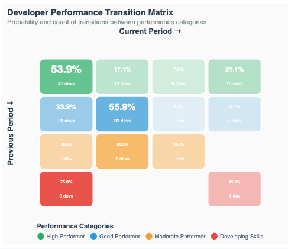

**Tür:** Transition Matrix (Heat Map)  
**Veri Kaynağı:** `git-stats` index

**Açıklama:** Geliştiricilerin aylık performans kategorileri arasındaki geçişlerini matrix formatında gösterir.

**Matrix Boyutları:**
- **Y Ekseni:** Previous Period (Önceki dönem kategorisi)
- **X Ekseni:** Current Period (Mevcut dönem kategorisi)
- **Renk Yoğunluğu:** Geçiş olasılık yüzdesi
- **Metin Etiketleri:** Yüzde ve geliştirici sayısı

**Performans Kategorileri:**
- High Performer (Yüksek Performans)
- Good Performer (İyi Performans)
- Moderate Performer (Orta Performans)
- Developing Skills (Gelişmekte)

**Kullanım Amacı:**
- Kariyer gelişimini takip etmek
- Performance improvement rate'lerini ölçmek
- Retention risk belirlemek

---

#### 21. Performance vs Activity Correlation - Efficiency Sweet Spots

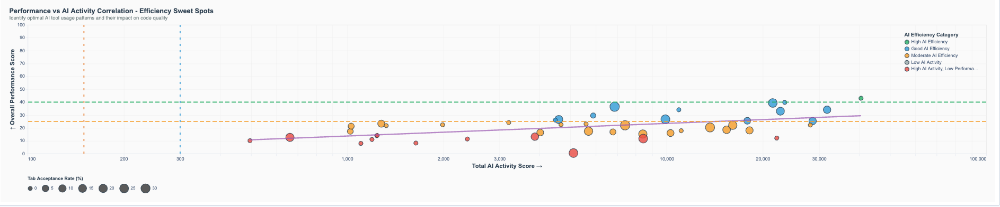

**Tür:** Scatter Plot  
**Veri Kaynağı:** `git-stats` ve `cursor-metrics` index

**Açıklama:** Geliştirici aktivite seviyesi ile performans arasındaki korelasyonu gösterir ve optimal efficiency noktalarını belirginleştirir.

**Eksen Tanımları:**
- **X Ekseni:** Total Activity Score (Logaritmik skala)
- **Y Ekseni:** Overall Performance Score
- **Renk Kodları:** Efficiency kategorilerine göre
- **Nokta Boyutu:** Average daily commits'e göre

**Efficiency Kategorileri:**
- High Efficiency (Yüksek Verimlilik)
- Good Efficiency (İyi Verimlilik)
- Moderate Efficiency (Orta Verimlilik)
- Low Activity (Düşük Aktivite)
- High Activity, Low Performance (Yüksek Aktivite, Düşük Performans)

**İleri Özellikler:**
- Logarithmic scaling for activity
- Trend lines ve correlation indicators
- Interactive tooltips
- Efficiency sweet spot highlighting

**Kullanım Amacı:**
- Optimal çalışma pattern'lerini belirlemek
- Aktivite ile kalite arasındaki dengeyi görmek
- Overwork veya underwork durumlarını tespit etmek

---

#### 22. Developer Performance Comparison (AI vs Non-AI)

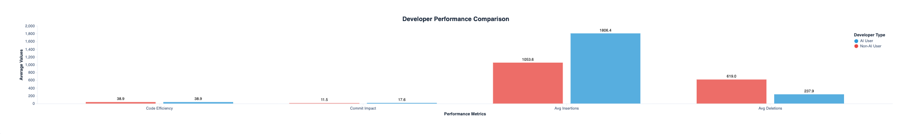

**Tür:** Grouped Bar Chart  
**Veri Kaynağı:** `git-stats` ve `cursor-metrics` index

**Açıklama:** AI kullanan ve AI kullanmayan geliştiriciler arasında performans metriklerini karşılaştırır.

**Karşılaştırılan Metrikler:**
- **Code Efficiency:** Ortalama kod verimliliği skorları
- **Commit Impact:** Ortalama commit etki skorları
- **Avg Insertions:** Ortalama eklenen satır sayısı
- **Avg Deletions:** Ortalama silinen satır sayısı

**Geliştirici Kategorileri:**
- **AI User (Mavi):** Cursor AI'ı aktif kullanan geliştiriciler (totalAccepts > 0)
- **Non-AI User (Kırmızı):** AI kullanmayan veya minimum kullanan geliştiriciler

**Görsel Özellikler:**
- Grouped bar chart layout
- Side-by-side comparison için her metrik için çift bar
- Hover interactivity ve değer etiketleri

**Kullanım Amacı:**
- AI impact'ini ölçmek
- ROI hesaplaması için veri
- AI adoption'ı teşvik etmek

---

#### 23. Developer Performance Flow - Category Transitions Over Time

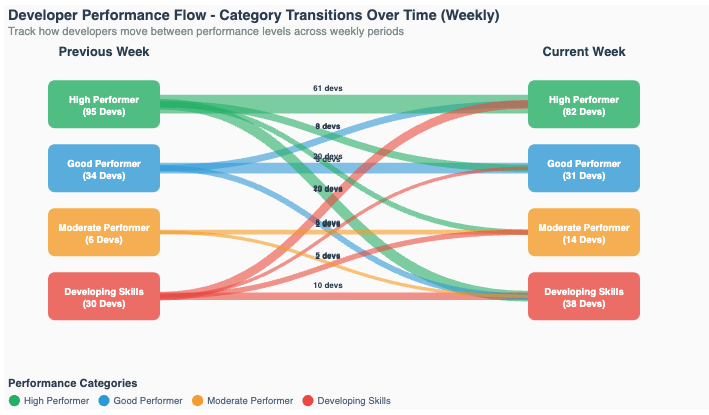

**Tür:** Flow Diagram (Sankey-like)  
**Veri Kaynağı:** `git-stats` index

**Açıklama:** Geliştiricilerin performans kategorileri arasındaki geçişlerini zaman içinde flow diagram formatında görselleştirir.

**Flow Kategorileri:**
- **High Performer (Yeşil):** Yüksek performans seviyesi (≥50 skor)
- **Good Performer (Mavi):** İyi performans seviyesi (30-49 skor)
- **Moderate Performer (Turuncu):** Orta performans seviyesi (15-29 skor)
- **Developing Skills (Kırmızı):** Gelişmekte olan beceriler (>0-14 skor)

**Görsel Özellikler:**
- **Previous Period (Sol Taraf):** Önceki dönemdeki performans kategorileri
- **Current Period (Sağ Taraf):** Mevcut dönemdeki performans kategorileri
- **Flow Lines:** Kategoriler arası geçişleri gösteren eğriler
- **Line Thickness:** Geçiş yapan geliştirici sayısına göre değişken kalınlık
- **Hover Tooltips:** Her akış için detaylı geçiş bilgileri

**Kullanım Amacı:**
- Geliştirici kariyer yolculuğunu takip etmek
- Performance improvement pattern'lerini analiz etmek
- Retention risk ve success story'leri belirlemek
- Team development stratejilerini şekillendirmek
- Coaching effectiveness'ını ölçmek

---

#### 24. Developer Performance Matrix: AI Score vs Commit Score

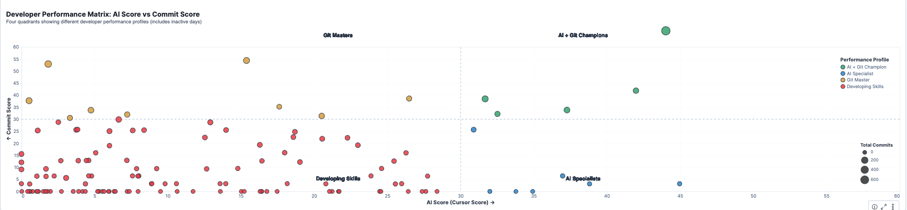

**Tür:** Scatter Plot (Quadrant Analysis)  
**Veri Kaynağı:** `git-stats` ve `cursor-metrics` index

**Açıklama:** Geliştiricileri AI skoru ve Commit skoru bazında 4 farklı performans profiline ayıran scatter plot matrisi.

**Performans Kadranları:**
- **AI + Git Champions (Yeşil):** Hem AI hem Commit skoru ≥50
- **AI Specialists (Mavi):** AI skoru ≥50, Commit skoru <50
- **Git Masters (Sarı):** Commit skoru ≥50, AI skoru <50
- **Developing Skills (Kırmızı):** Her iki skor da <50

**Görsel Elementleri:**
- **X Ekseni:** AI Score (Cursor Score) 0-100 aralığı
- **Y Ekseni:** Commit Score 0-100 aralığı
- **Nokta Rengi:** Performans kadranına göre
- **Nokta Boyutu:** Total commits sayısına göre (sqrt scale)
- **Grid Lines:** 50 referans çizgileri (kesikli)
- **Quadrant Labels:** Her kadranın köşesinde etiket

**Kullanım Amacı:**
- Geliştiricileri profile'lara ayırmak
- Strength ve development area'larını belirlemek
- Targeted coaching stratejileri oluşturmak

---

### AI Metrikleri Görselleri

#### 25. AI Acceptance Rate (Metric)

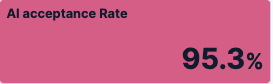

**Tür:** Metrik (Percentage)  
**Veri Kaynağı:** `cursor-metrics` index

**Açıklama:** AI önerilerinin kabul edilme oranını yüzdelik değer olarak gösterir.

**Hesaplama Formülü:**
```
AI Acceptance Rate = (sum(totalAccepts) / sum(totalApplies)) × 100
```

**Metrikler:**
- **Değer:** Yüzdelik format ile gösterim (1 decimal precision)
- **Renk:** Pembe tonunda (#D36086)
- **Format:** Percentage formatında display

**Formül Bileşenleri:**
- **totalAccepts:** Kabul edilen AI önerilerinin toplam sayısı
- **totalApplies:** Uygulanan AI önerilerinin toplam sayısı

**Kullanım Amacı:**
- AI tool effectiveness'ını ölçmek
- Kullanıcı memnuniyetini indirect ölçmek
- AI model quality'yi track etmek

---

#### 26. File Types: Heavy AI Users vs No AI Users

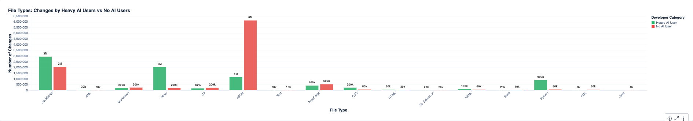

**Tür:** Grouped Bar Chart  
**Veri Kaynağı:** `git-stats` ve `cursor-metrics` index

**Açıklama:** AI'ı yoğun kullanan geliştiriciler ile hiç AI kullanmayan geliştiriciler arasında dosya türü bazında kod değişiklik pattern'lerini karşılaştırır.

**Geliştirici Kategorileri:**
- **Heavy AI User (Yeşil):** Total AI aktivitesi >20 (totalAccepts + totalApplies)
- **No AI User (Kırmızı):** AI aktivitesi sıfır veya minimal

**Analiz Edilen Dosya Türleri:**
- C# (.cs), JavaScript (.js), TypeScript (.ts)
- Python (.py), JSON (.json), HTML (.html)
- CSS (.css), XML (.xml), Markdown (.md)
- Other (Diğer dosya türleri)

**Görsel Özellikler:**
- Grouped bar chart layout
- Her dosya türü için yan yana karşılaştırma
- Hover tooltips ile detaylı değişiklik sayıları
- Filtered data (minimum 500 toplam değişiklik)

**Kullanım Amacı:**
- Hangi dosya türlerinde AI daha çok kullanıldığını görmek
- AI adoption pattern'lerini anlamak
- Technology stack bazlı AI effectiveness

---

### DORA Metrikleri Görselleri

#### 27. DORA Lead Time Average by Team

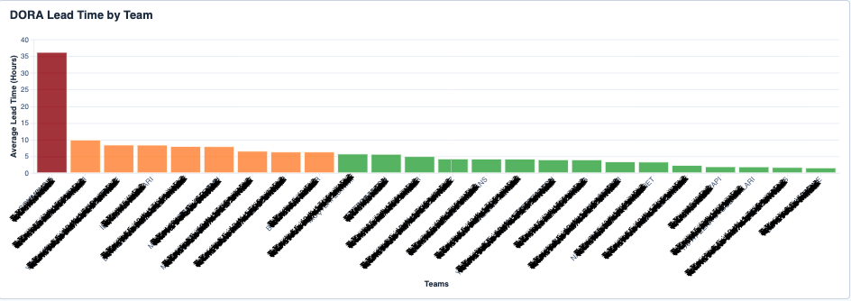

**Tür:** Bar Chart (Performance Level Colored)  
**Veri Kaynağı:** `dora-lead-time` index

**Açıklama:** Takım bazında ortalama DORA Lead Time metriklerini saat cinsinden görselleştirir. DORA (DevOps Research and Assessment) Lead Time, kod commit'inden production deployment'a kadar geçen süreyi ölçer.

**Özellikler:**
- **X Ekseni:** Team adları (45 derece döndürülmüş etiketler)
- **Y Ekseni:** Average Lead Time (Saat)
- **Renk Kodlaması (Performance Level):**
  - **Yeşil (#2ca02c):** Elite (< 6 saat)
  - **Turuncu (#ff7f0e):** High (6-12 saat)
  - **Kırmızı (#d62728):** Medium (12-24 saat)
  - **Koyu Kırmızı (#8b0000):** Low (> 24 saat)

**Tooltip Bilgileri:**
- Team adı
- Average Lead Time (saat ve gün cinsinden)
- Total Deployments sayısı
- Performance Level (Elite/High/Medium/Low)

**Kullanım Amacı:**
- Takım bazlı delivery speed'i karşılaştırmak
- Bottleneck'leri tespit etmek
- DORA benchmark'larına göre değerlendirme

---

#### 28. DORA Lead Time Average by Product

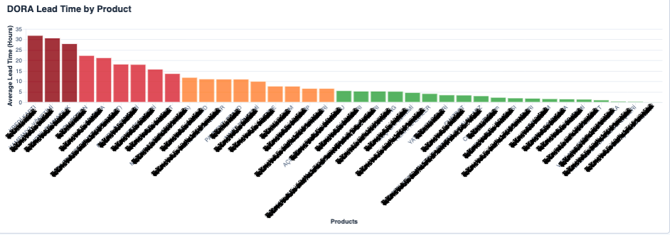

**Tür:** Bar Chart (Performance Level Colored)  
**Veri Kaynağı:** `dora-lead-time` index

**Açıklama:** Ürün bazında ortalama DORA Lead Time metriklerini saat cinsinden görselleştirir. Multi-product deployment'lar için ürünler ayrıştırılarak analiz edilir.

**Özellikler:**
- **X Ekseni:** Product adları (45 derece döndürülmüş etiketler)
- **Y Ekseni:** Average Lead Time (Saat)
- **Renk Kodlaması:** Elite/High/Medium/Low performance levels

**Veri İşleme:**
- Product field'ı comma-separated değerler için split edilir
- Her ürün individual olarak işlenir (flatten transformation)
- Boş ve "non" değerler filtrelenir

**Kullanım Amacı:**
- Ürün bazlı delivery performance
- Product complexity assessment
- Release planning için insight

---

#### 29. DORA Deployment Frequency by Team

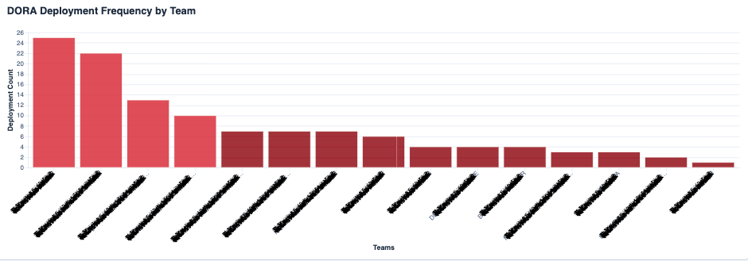

**Tür:** Bar Chart (Performance Level Colored)  
**Veri Kaynağı:** `dora-deployment-frequency` index

**Açıklama:** Takım bazında DORA Deployment Frequency metriklerini görselleştirir. Her takımın belirli bir zaman periyodundaki toplam deployment sayısını analiz eder.

**Özellikler:**
- **X Ekseni:** Team adları
- **Y Ekseni:** Deployment Count
- **Renk Kodlaması (Performance Level):**
  - **Yeşil (#2ca02c):** Elite (>90 deployment/month)
  - **Turuncu (#ff7f0e):** High (51-90 deployment)
  - **Kırmızı (#d62728):** Medium (11-50 deployment)
  - **Koyu Kırmızı (#8b0000):** Low (≤10 deployment)

**Tooltip Bilgileri:**
- Team adı
- Deployment Count
- Percentage (toplam deployment'lara göre)
- Performance Level

**DORA Benchmark Kategorileri:**
- **Elite:** Günde birden fazla deployment
- **High:** Haftada bir ile ayda bir arası
- **Medium:** Ayda bir ile 6 ayda bir arası
- **Low:** 6 aydan daha seyrek

**Kullanım Amacı:**
- Deployment maturity seviyesini ölçmek
- CI/CD effectiveness'ını değerlendirmek
- DevOps transformation progress tracking

---

#### 30. DORA Deployment Frequency by Product

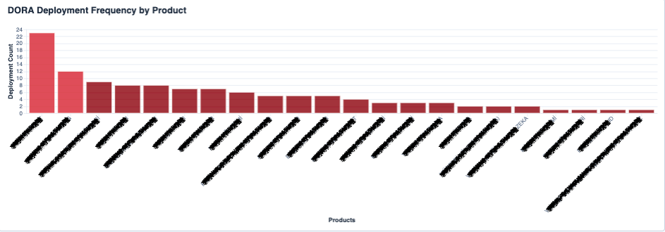

**Tür:** Bar Chart (Performance Level Colored)  
**Veri Kaynağı:** `dora-deployment-frequency` index

**Açıklama:** Ürün bazında DORA Deployment Frequency metriklerini görselleştirir. Multi-product release'ler için ürünler ayrıştırılarak individual deployment frequency analizi yapılır.

**Özellikler:**
- **X Ekseni:** Product adları
- **Y Ekseni:** Deployment Count
- **Renk Kodlaması:** Performance levels

**Veri İşleme:**
- Product field'ı comma-separated için split
- Her ürün individual olarak aggregate
- "non" product'lar filtrelenir

**Kullanım Amacı:**
- Product release rhythm analizi
- Technology stack comparison
- Release strategy optimization

---

#### 31. DORA Change Failure Rate by Team

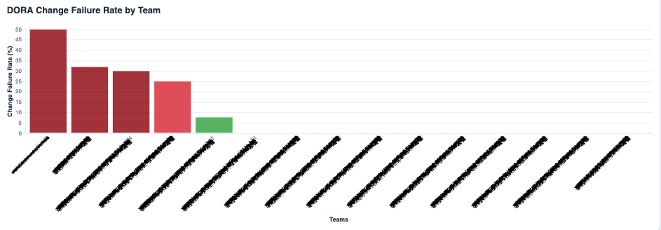

**Tür:** Bar Chart (Performance Level Colored)  
**Veri Kaynağı:** `dora-deployment-frequency` index

**Açıklama:** Takım bazında DORA Change Failure Rate metriklerini görselleştirir. Change Failure Rate, deployment'ların ne kadarının hata nedeniyle geri alındığını veya hotfix gerektirdiğini ölçer.

**Özellikler:**
- **X Ekseni:** Team adları
- **Y Ekseni:** Change Failure Rate (Yüzde)
- **Renk Kodlaması (Performance Level):**
  - **Yeşil (#2ca02c):** Elite (< 10% failure rate)
  - **Turuncu (#ff7f0e):** High (10-20% failure rate)
  - **Kırmızı (#d62728):** Medium (20-30% failure rate)
  - **Koyu Kırmızı (#8b0000):** Low (> 30% failure rate)

**Hesaplama Formülü:**
```
Change Failure Rate = (1 - ((Total Deployments - Hotfix Deployments) / Total Deployments)) × 100
```

**Tooltip Bilgileri:**
- Team adı
- Change Failure Rate (yüzde)
- Total Deployments
- Hotfix Deployments
- Success Rate

**DORA Benchmark Kategorileri:**
- **Elite:** %10'dan az failure rate
- **High:** %10-20 arası
- **Medium:** %20-30 arası
- **Low:** %30'dan fazla

**Kullanım Amacı:**
- Code quality ve testing effectiveness'ı ölçmek
- Production stability tracking
- Risk assessment

---

#### 32. DORA Change Failure Rate by Product

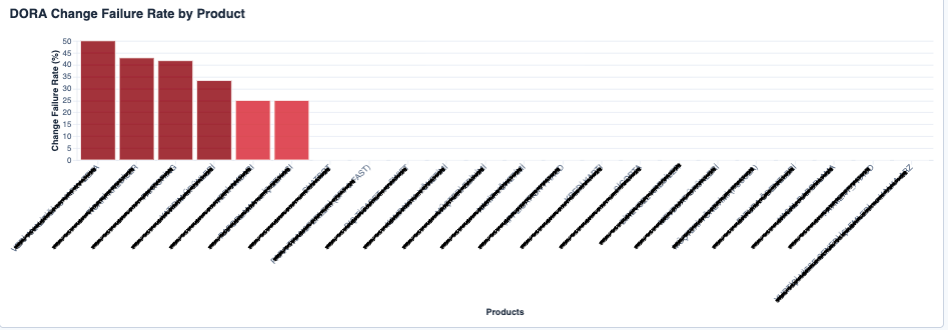

**Tür:** Bar Chart (Performance Level Colored)  
**Veri Kaynağı:** `dora-deployment-frequency` index

**Açıklama:** Ürün bazında DORA Change Failure Rate metriklerini görselleştirir. Multi-product deployment'lar için ürünler ayrıştırılarak individual failure rate analizi yapılır.

**Özellikler:**
- **X Ekseni:** Product adları
- **Y Ekseni:** Change Failure Rate (Yüzde)
- **Renk Kodlaması:** Performance levels

**Hesaplama Formülü:**
```
Change Failure Rate = (1 - ((Total Deployments - Hotfix Deployments) / Total Deployments)) × 100
```

**Kullanım Amacı:**
- Product quality comparison
- Technical debt assessment
- Testing strategy evaluation

---

#### 33. DORA Metrics Product Performance Chart (Bubble Chart)

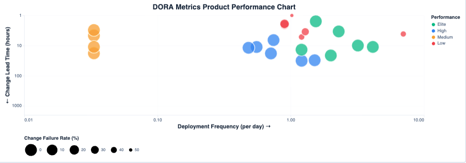

**Tür:** Bubble Chart (Multi-Dimensional)  
**Veri Kaynağı:** `dora-deployment-frequency` ve `dora-lead-time` index

**Açıklama:** Ürün bazında DORA metriklerini çok boyutlu bubble chart formatında görselleştirir. Bu gelişmiş analiz, deployment frequency, lead time ve change failure rate'i aynı grafikte göstererek ürün performansının holistic değerlendirmesini sağlar.

**Bubble Chart Boyutları:**
- **X Ekseni:** Deployment Frequency (günlük, logaritmik skala)
- **Y Ekseni:** Change Lead Time (saat cinsinden, logaritmik skala - ters)
- **Bubble Boyutu:** Change Failure Rate (büyük bubble = yüksek failure rate)
- **Renk Kodlaması:** DORA Performance Level

**Performance Level Kategorileri:**
- **Elite (Yeşil #10b981):** Deploy/Day ≥1, Lead Time ≤24h, Failure Rate ≤5%
- **High (Mavi #3b82f6):** Deploy/Day ≥0.14, Lead Time ≤168h, Failure Rate ≤10%
- **Medium (Sarı #f59e0b):** Deploy/Day ≥0.03, Lead Time ≤720h, Failure Rate ≤15%
- **Low (Kırmızı #ef4444):** Diğer tüm durumlar

**Gelişmiş Özellikler:**
- Logaritmik skalalar: Geniş value range'leri için optimal görsellik
- Dual data source join: Deployment ve Lead Time verilerinin birleştirilmesi
- Dynamic date range: Time span'e göre otomatik normalizasyon
- Interactive hover: Detaylı tooltip bilgileri

**Tooltip Bilgileri:**
- Product adı
- Deployments per Day
- Total Deployments
- Average Lead Time (hours)
- Median Lead Time (hours)
- Change Failure Rate (%)
- Hotfix Deployments
- Performance Level

**Kullanım Amacı:**
- Ürün performansını holistic değerlendirme
- Multi-dimensional comparison
- Strategic planning için insight
- Investment decision support

---

#### 34. DORA Metrics Team Performance Chart (Bubble Chart)

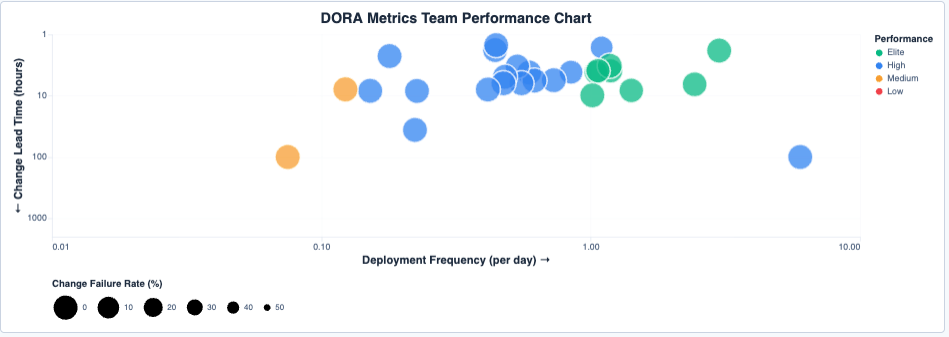

**Tür:** Bubble Chart (Multi-Dimensional)  
**Veri Kaynağı:** `dora-deployment-frequency` ve `dora-lead-time` index

**Açıklama:** Takım bazında DORA metriklerini çok boyutlu bubble chart formatında görselleştirir. Bu analiz, takımların deployment maturity'sini ve DevOps capability'sini comprehensive şekilde değerlendirmeyi sağlar.

**Bubble Chart Boyutları:**
- **X Ekseni:** Deployment Frequency (günlük, logaritmik skala)
- **Y Ekseni:** Change Lead Time (saat cinsinden, logaritmik skala - ters)
- **Bubble Boyutu:** Change Failure Rate
- **Renk Kodlaması:** DORA Performance Level

**Performance Level Kategorileri:**
- Elite, High, Medium, Low (Product chart ile aynı kriterler)

**Teknik Özellikler:**
- Logaritmik scale optimization
- Cross-index data join
- Dynamic normalization
- Interactive selection

**Tooltip Bilgileri:**
- Team adı
- Deployments per Day
- Average Lead Time
- Median Lead Time
- Change Failure Rate
- Performance Level

**Kullanım Amacı:**
- Takımlar arası DevOps maturity comparison
- Coaching ve training prioritization
- Best practice sharing identification
- Process improvement roadmap planning
- DevOps transformation success measurement

---

### İleri Analiz Görselleri

#### 35. AI Impact on Deployment Frequency

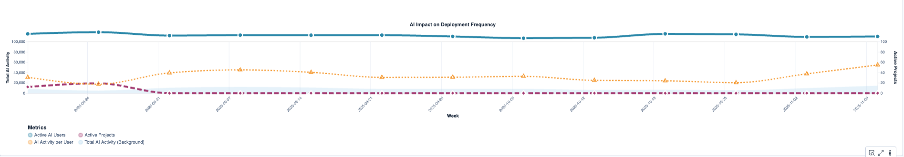

**Tür:** Multi-Layer Line Chart with Area Background  
**Veri Kaynağı:** `dora-deployment-frequency`, `cursor-usage`, `cursor-usage-events` index

**Açıklama:** AI kullanımının deployment frekansı üzerindeki etkisini haftalık bazda çok katmanlı görselleştirme ile analiz eder. AI metrikleri ile deployment frekans metrikleri arasındaki korelasyonu ortaya çıkarmayı hedefler.

**Görsel Katmanları:**
1. **Background Area Layer (Açık Mavi):** Total AI Activity değerlerini arkaplan olarak gösterir
2. **Active AI Users Line (Koyu Mavi):** Haftalık aktif AI kullanıcı sayısı (Scale: 0-120)
3. **Active Projects Line (Mor):** Deployment yapılan proje sayısı (Scale: 0-40)
4. **AI Activity per User Line (Turuncu):** Kullanıcı başına AI aktivite yoğunluğu (Scale: 0-100)

**Tooltip Detayları:**
- Week (YYYY-MM-DD)
- Active AI Users
- AI Accepts
- Chat Requests
- Composer Requests
- Avg Cursor Score
- Active Projects
- Hotfixes

**Hesaplama Formülleri:**
```
total_ai_activity = total_accepts + total_chat_requests + total_composer_requests
ai_activity_per_user = total_ai_activity / active_users (if > 0)
```

**Kullanım Amacı:**
- AI kullanımı ile deployment sıklığı arasındaki korelasyonu görmek
- AI adoption'ın business impact'ini ölçmek
- ROI hesaplaması için veri
- AI tool investment justification

---

#### 36. AI Usage vs Lead Time Analysis

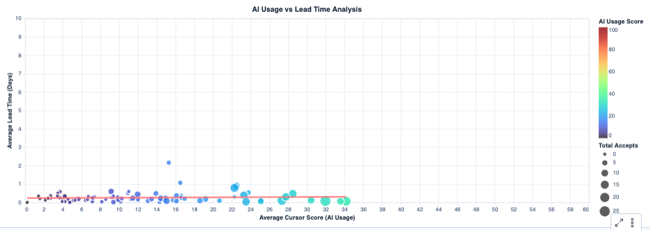

**Tür:** Scatter Plot with Regression Line  
**Veri Kaynağı:** `dora-lead-time` ve `cursor-usage` index

**Açıklama:** Geliştirici bazında AI kullanım etkinliği ile DORA Lead Time metrikleri arasındaki korelasyonu dağılım grafiği ile analiz eder. Regresyon çizgisi ile trend eğilimi gösterilir.

**Görsel Elementleri:**
1. **Scatter Points:**
   - **X Ekseni:** Average Cursor Score (AI Usage) - 0-60 aralığı
   - **Y Ekseni:** Average Lead Time (Days) - 0-10 gün aralığı
   - **Nokta Boyutu:** Total Accepts değerine göre (50-400 px range)
2. **Regression Line:**
   - Kırmızı trend çizgisi
   - AI kullanımı ile lead time arasındaki ilişki

**Veri Filtreleme:**
- Sadece cursor_score > 0 olan developer'lar
- Lead time > 0 olan kayıtlar
- Minimum 300 developer analizi

**Tooltip İçeriği:**
- Developer adı
- Cursor Score (1 decimal)
- Lead Time (Days) (3 decimal precision)
- Total Accepts (1 decimal)
- Total Records

**Kullanım Amacı:**
- AI kullanımının delivery speed'e etkisini ölçmek
- Negative correlation'u göstermek (AI ↑, Lead Time ↓)
- Individual developer level'da AI effectiveness
- Training ve adoption strategy için data-driven decision

---

## Dashboard Yerleştirme ve Layout

Dashboard, görselleri mantıksal gruplara ayırarak organize eder:

### Üst Bölüm - KPI Overview
- Metrik kartları (8-10 adet)
- Hızlı özet bilgiler

### İkinci Bölüm - Trend Analizi
- Zaman serisi grafikleri
- Line chart'lar
- Aktivite trendleri

### Üçüncü Bölüm - Dağılım ve Kompozisyon
- Donut chart'lar
- Category breakdowns
- Distribution görselleri

### Dördüncü Bölüm - Developer Performance
- Performance table
- Comparison chart'ları
- Ranking görselleri

### Beşinci Bölüm - DORA Metrikleri
- DORA bar chart'ları
- Bubble chart'lar
- Team/Product comparison

### Altıncı Bölüm - İleri Analiz
- Correlation analysis
- Flow diagram'lar
- Transition matrices
- Scatter plot'lar

### Alt Bölüm - Detaylı Tablolar
- Commit statistics details
- Raw data tables
- Drill-down için

---

## Filtreleme ve Interactivity

Dashboard, tüm görseller için ortak filtreler sunar:

- **Time Range:** Tarih aralığı seçimi (Dashboard üst bar)
- **Developer:** Geliştirici adına göre filtreleme
- **Project:** Proje bazlı filtreleme
- **Repository:** Repository bazlı filtreleme
- **Team:** Takım bazlı filtreleme
- **Category:** Commit kategorisi filtreleme
- **Performance Level:** DORA performance level filtreleme

Filtreler, tüm görsellere otomatik olarak uygulanır ve real-time güncelleme sağlar.

---

## 💼 Kullanım Örnekleri ve Senaryolar

### Senaryo 1: Yeni Ekip Üyesinin Performans Takibi

**Durum**: Ekibe yeni katılan bir geliştirici var, ilk 3 aydaki gelişimini takip etmek istiyorsunuz.

**Dashboard Kullanımı**:

1. Zaman filtresi: "Last 90 days"
2. Developer filter'dan yeni üyeyi seçin
3. İzlenecek Metrikler:

| Metrik | 1. Ay | 2. Ay | 3. Ay | Hedef |
|--------|-------|-------|-------|-------|
| Günlük Commit | 2-3 | 4-5 | 6-8 | 6+ |
| cefficiency | 0.65 | 0.72 | 0.78 | >0.70 |
| Churn/Rework % | 35% | 25% | 18% | <20% |
| Cursor Score | 45 | 62 | 78 | >70 |

**Beklenen Gelişim**:
- ✅ Commit sayısı artmalı
- ✅ Efficiency iyileşmeli
- ✅ Churn/Rework azalmalı
- ✅ AI kullanımı artmalı

### Senaryo 2: Sprint Retrospective için Veri Analizi

**Durum**: 2 haftalık sprint bitti, retrospective için objective data istiyorsunuz.

**Sprint Özet Kartı Örneği**:

```
📊 Sprint 42 Summary (Oct 16 - Oct 30)

Commits: 156
Developers: 8
Total Lines Changed: 12,450
Average cefficiency: 0.74

Category Breakdown:
  New Work: 48% ✅
  Refactor: 22% ✅
  Help Others: 16% ✅
  Churn/Rework: 14% ✅

DORA Metrics:
  Deployments: 12
  Avg Lead Time: 18 hours ⭐
  Failure Rate: 8% ✅

AI Usage:
  Avg Cursor Score: 72
  Acceptance Rate: 76%
```

**Retrospective Soruları**:

✅ **What went well?**
- Lead time 18 saat (hedef: <24 saat)
- Churn/Rework düşük (%14)
- AI kullanımı yüksek

⚠️ **What needs improvement?**
- Deployment sayısı az (12, hedef: 14+)
- New Work oranı biraz düşük (hedef: %50+)

🎯 **Action Items**:
- Daha küçük feature'lar için daha sık deployment
- Refactor işlerini separate sprint'e taşı

### Senaryo 3: AI Kullanımının Performansa Etkisi

**Araştırma Sorusu**: "AI kullanan geliştiriciler daha üretken mi?"

**Analiz**:

Geliştiricileri gruplama:
- **Grup A (High AI Users)**: Cursor Score > 75
- **Grup B (Low AI Users)**: Cursor Score < 50

**Metrik Karşılaştırması**:

| Metrik | High AI | Low AI | Fark |
|--------|---------|--------|------|
| Commits/day | 4.2 | 2.8 | +50% ⬆️ |
| cefficiency | 0.78 | 0.68 | +15% ⬆️ |
| Lead Time | 18h | 32h | -44% ⬆️ |
| Churn Rate | 14% | 26% | -46% ⬆️ |
| New Work % | 52% | 41% | +27% ⬆️ |

**Sonuç**: ✅ AI kullanımı ile üretkenlik arasında güçlü pozitif korelasyon

### Senaryo 4: Haftalık Takım Toplantısı

**Dashboard Flow** (20 dakika):

1. **Overview Panel** (5 dk) - Genel metrikler
2. **Category Distribution** (3 dk) - Commit kategori dağılımı
3. **DORA Metrics** (5 dk) - Deployment, lead time, failure rate
4. **Highlight Developers** (3 dk) - En iyi performanslar
5. **Action Items** (4 dk) - Gelecek hafta planı

---

## 🔧 Script'ler ve Veri Toplama

### Script Çalıştırma Sırası

Verileri toplarken önerilen sıra:

#### 1. Git Metrics (Temel veriler)

```bash
python scripts/gitstats.py \
  --repo-path /path/to/repo \
  --elasticsearch-url http://localhost:9200 \
  --elasticsearch-user elastic \
  --elasticsearch-password password \
  --names-input-file scripts/users.txt \
  --days 30
```

**Çıktı Index**: `git-commits`

#### 2. DORA Metrics (Deployment verileri)

```bash
python scripts/dora-metrics.py \
  --elasticsearch-url http://localhost:9200 \
  --elasticsearch-user elastic \
  --elasticsearch-password password \
  --db-host your-sql-server \
  --db-name your_database \
  --db-username your_user \
  --db-password your_password \
  --teams-file scripts/teams.txt \
  --days 30
```

**Çıktı Index'ler**:
- `dora-deployment-frequency`
- `dora-lead-time`
- `dora-change-failure-rate`

#### 3. Cursor Metrics (AI kullanım verileri)

```bash
python scripts/cursor_metrics.py \
  --cursor-api-url https://api.cursor.com \
  --cursor-username your_username \
  --cursor-password your_password \
  --elasticsearch-url http://localhost:9200 \
  --elasticsearch-user elastic \
  --elasticsearch-password password \
  --users-file scripts/users.txt \
  --days 30
```

**Çıktı Index**: `cursor-metrics`

### Otomatik Çalıştırma

#### Cron Job Örneği (Linux/macOS)

```bash
# Her gün saat 02:00'da çalış
0 2 * * * cd /path/to/scripts && /path/to/venv/bin/python gitstats.py \
  --repo-path /repos/myrepo \
  --elasticsearch-url http://localhost:9200 \
  --elasticsearch-user elastic \
  --elasticsearch-password password \
  --names-input-file users.txt \
  --days 1
```

#### Performans İpuçları

**Büyük Repository'ler için**:

```bash
# Sadece son N gün için çalıştır
python gitstats.py --days 7 ...

# Specific branch için
python gitstats.py --branch main ...
```

**Paralel Çalıştırma**:

```bash
#!/bin/bash
python gitstats.py --repo-path /repos/repo1 ... &
python gitstats.py --repo-path /repos/repo2 ... &
python gitstats.py --repo-path /repos/repo3 ... &
wait
```

---

## 🔍 Sorun Giderme

### Elasticsearch Bağlantı Hatası

```bash
# Elasticsearch'ün çalışıp çalışmadığını kontrol et
curl http://localhost:9200

# Authentication'ı test et
curl -u elastic:password http://localhost:9200/_cluster/health
```

### SQL Server Bağlantı Hatası

```python
# Test connection
import pyodbc
conn = pyodbc.connect(
    'DRIVER={ODBC Driver 17 for SQL Server};'
    'SERVER=your-server;DATABASE=your-db;UID=user;PWD=pass'
)
print(conn)
```

### Cursor API Hatası

```bash
# API erişimini test et
curl -u username:password https://api.cursor.com/health
```

### Hata Ayıklama

**Verbose Mode**:

```bash
python gitstats.py --verbose ...
```

**Log Dosyası**:

```bash
python gitstats.py ... 2>&1 | tee git_stats.log
```

**Dry Run Mode**:

```bash
python gitstats.py --dry-run ...
```

---

## 🔒 Güvenlik ve En İyi Pratikler

### Güvenlik Notları

⚠️ **ÖNEMLİ**:

1. **Şifreleri kod içine yazmayın**
   - Environment variables kullanın
   - Secret management tools kullanın

2. **users.txt ve teams.txt dosyalarını paylaşmayın**
   - Bu dosyalar `.gitignore`'da listelenmiştir
   - Örneklerini `.example` uzantılı olarak ekleyin

3. **Log dosyalarını kontrol edin**
   - Sensitive bilgi içerebilirler
   - Production'da log level'i ayarlayın

### Dashboard Kullanma En İyi Pratikleri

### Günlük İnceleme
- [ ] Dün yapılan commit'leri gözden geçir
- [ ] Churn/Rework oranını kontrol et
- [ ] AI acceptance rate'e bak

### Haftalık Review
- [ ] Commit kategori dağılımını incele
- [ ] Lead time trend'ine bak
- [ ] Takım bazında performans karşılaştır
- [ ] Cursor score gelişimini takip et

### Aylık Analiz
- [ ] DORA metriklerini değerlendir
- [ ] Üretkenlik trendlerini incele
- [ ] AI impact'i ölç ve raporla
- [ ] İyileştirme aksiyonlarını planla

### Önemli Metrikler Hızlı Referans

| Metrik | İdeal Değer | Kritik Eşik |
|--------|-------------|-------------|
| cefficiency | > 0.7 | < 0.5 |
| Churn/Rework % | < 20% | > 40% |
| Deployment Frequency | Günlük | < Haftalık |
| Lead Time | < 1 gün | > 1 hafta |
| Change Failure Rate | < 15% | > 30% |
| AI Acceptance Rate | > 70% | < 40% |
| Cursor Score | > 70 | < 40 |

---

## 🎓 Özet

Bu sistem, geliştirici performansını ve AI etkisini ölçümlemek için kapsamlı bir platform sağlar:

✅ **4 Commit Kategorisi**: New Work, Refactor, Help Others, Churn/Rework  
✅ **Verimlilik Metrikleri**: cefficiency, commit_impact  
✅ **DORA Metrikleri**: Deployment frequency, lead time, failure rate  
✅ **AI Metrikleri**: Cursor score, acceptance rate  
✅ **35+ Dashboard Görseli**: Comprehensive analiz ve raporlama  
✅ **Data-Driven Kararlar**: Objektif metriklerle iyileştirme  

---

## 📞 İletişim ve Destek

Sorularınız için repository sahibi ile iletişime geçebilirsiniz.

## 📝 Lisans

Bu proje şirket içi kullanım için tasarlanmıştır.

---

**© 2025 - AI Destekli Geliştirici Verimlilik Analizi**

